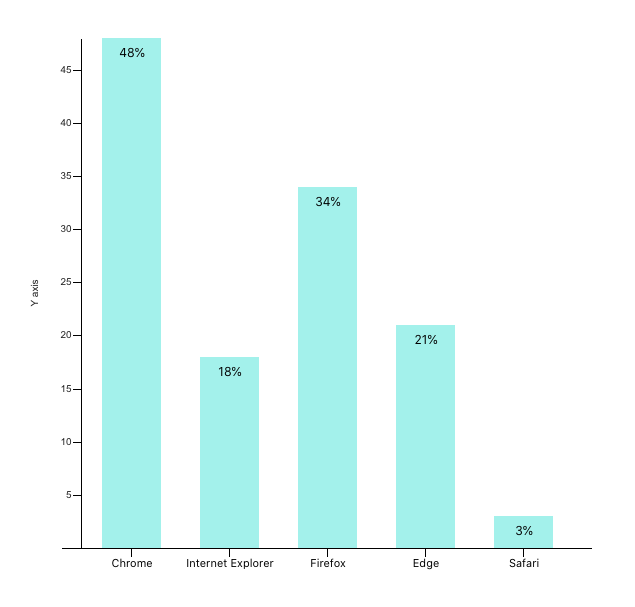
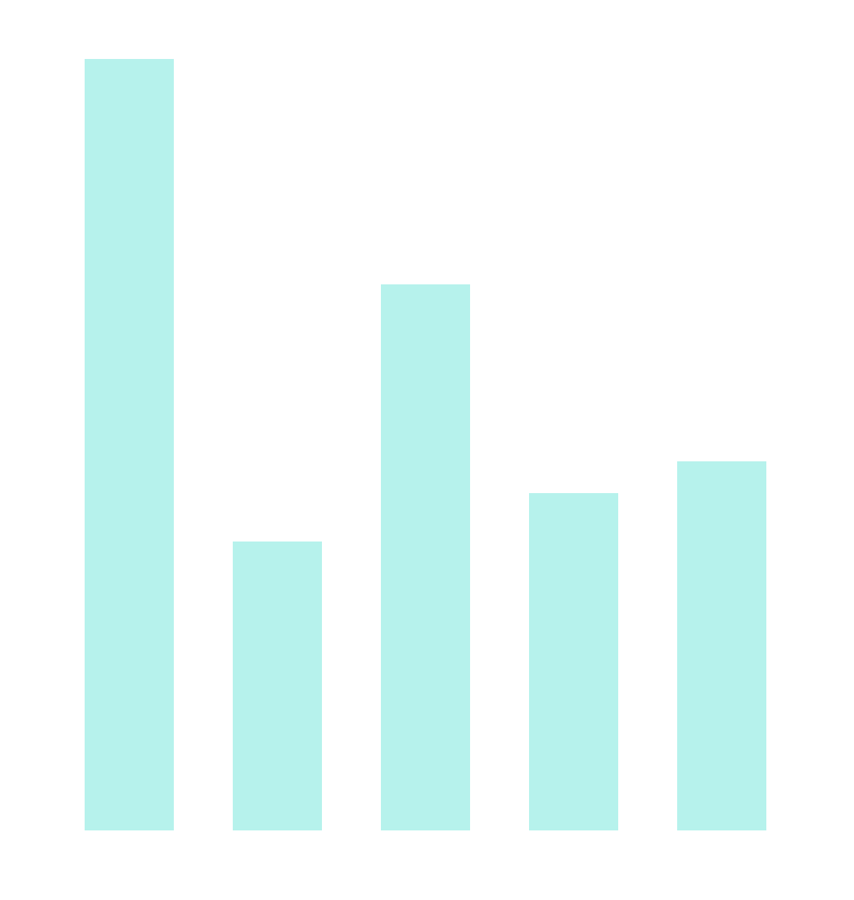

Airbnb visx is a library that offers visualisation components that we can use to create own chart components. In this article we will create a bar chart component using visx. The library uses several D3 packages internally for data processing. And for rendering its all React. Essentially for React application is best of both worlds. D3 for calculations and React for rendering.

Here is how our final result will look. It is a bar chart that shows browser usage on a certain date. The browser usage data is a mock that is generated for the purpose of this article.



Step 1 Install required packages.

An important benefit of visx is that it is split into multiple packages. We can pick and choose only the packages required for our application. It helps to keep the bundle size minimal.

```jsx
npm install --save @visx/group @visx/scale @visx/shape
```

Step 2 Gather the data.

Our browser usage is defined in the following array of objects. Usage is in percent values.

```jsx
type BrowserUsage = {
  browser: string;
  usage: number;
}

const data: BrowserUsage[] = [
  { browser: 'Chrome', usage: 48},
  { browser: 'Internet Explorer', usage: 18},
  { browser: 'Firefox', usage: 34},
  { browser: 'Edge', usage: 21},
  { browser: 'Safari', usage: 23},
];
```

Step 3: The bar chart component definition

We will pass this data as a prop to our component. We will also specify fixed width and height for this chart. In a separate article we can leverage another visx component called `visx/responsive` to make the chart responsive.

```jsx
<BarChart width={600} height={600} data={data} />
```

Let's write the code for the component itself. We will begin by defining the props. and couple of helper function to access browser and usage from each `browserUsage` object.

```jsx
import React, { useMemo } from 'react';

// we declare the type of that our data is made of
export type BrowserUsage = {
  browser: string;
  usage: number;
}

export type BarChartProps = {
  width: number;
  height: number;
  events?: boolean;
  data: BrowserUsage[];
  margin?: { top: number; right: number; bottom: number; left: number };
};

const defaultMargin = { top: 40, right: 30, bottom: 50, left: 40 }; // some margin around the chart.
const getBrowser = (d: BrowserUsage) => d.browser; 
const getUsage = (d: BrowserUsage) => d.usage;

export default function BarChart({ width, height, data, events = false, margin = defaultMargin }: BarChartProps) {
	return null;
}
```

Step 4 Create the scales

In data visualisation we take input data and transform it into visual output in pixel size. For example in out case browser usage will be transformed to represent height of each bar. This transformation is performed via scale functions. There are many types of scale functions. We will be using two types here.

Every scale in visx has two parts: a domain and a range.

Domain are input values. In our case list of browsers and related usage in percent are our domain.

Range are corresponding output values.

For Y Axis we need a linear scale function offered by `@visx/scale` package. yMax is our maximum height. For range we pass [yMax, 0] and this is because svg coordinate system 

```jsx
const yScale = useMemo(
    () =>
      scaleLinear<number>({
        range: [yMax, 0],
        round: true,
        domain: [0, Math.max(...data.map(getUsage))],
      }),
    [yMax],
  );

console.log(yScale(18)); // output 319
console.log(yScale(23)); // output 266
```

For X axis we need to show list of browsers. We will use band scale to achieve this offered by `@visx/scale` package. Band scale returns discrete width for each of our bar based on the domain (browsers) and range (maximum width) we pass to it.

```jsx
const xScale = useMemo(
    () =>
      scaleBand<string>({
        range: [0, xMax],
        round: true,
        domain: data.map(getBrowser),
        padding: 0.4,
      }),
    [xMax],
  );
```

Step 5 Rendering the bars in our chart

The bars are grouped inside a Group tag which is equivalent of div in svg. We map over each object in data and render a bar.

1. We use 
2. bar width is calculated from `xScale.bandwidth()` which gives us a discrete width value.
3. bar height is total height minus the value returned from yScale function. 
4. barX and barY are point where each bar is displayed. x, y, barHeight and barWidth together form a bar.
5. fill is used to supply color value to the bar

```jsx
return (
    <svg width={width} height={height}>
      <Group top={60} left={40}>
        {data.map((d, index) => {
          const b = getBrowser(d);
          const barWidth = xScale.bandwidth();
          const barHeight = yMax - (yScale(getUsage(d)) ?? 0);
          const barX = xScale(b);
          const barY = yMax - barHeight;
          
          return (
            <Bar
              key={`bar-${b}`}
              x={barX}
              y={barY}
              width={barWidth}
              height={barHeight}
              fill="rgba(23, 233, 217, .5)"
              onClick={() => {
                if (events) alert(`click`);
              }}
            />
          );
        })}
		</svg>
  );
}
```

And we have our barchart.



Step 6: Axes

visx provides a declarative way via components to render axes called `@visx/axis` package. `AxisLeft` for our Y axis and `AxisBottom` for X axis. Here too we simply pass our scale functions and components will use them to calculate values displayed on axes.

```jsx
// right after </Group>..
<AxisLeft
  top={60}
  left={60}
  scale={yScale}
  label="Y axis"
  stroke="#000"
  tickStroke="#000"
  hideZero
/> 
<AxisBottom
  top={yMax + 60}
  left={40}
  scale={xScale}
  stroke="#000"
  tickStroke="#000"
  tickLabelProps={() => ({
    fill: "#000",
    fontSize: 11,
    textAnchor: 'middle',
  })}
/>
```

We can also show percent value on the top of each bar using `@visx/text` component as follows.

```jsx
// right after <Bar> ends.
<Text
  x={barX}
  dx={30}
  dy={10}
  y={yMax - barHeight}
  fill="black"
  fontSize={12}
  verticalAnchor="start"
  textAnchor="middle"
>
  {`${Math.round(getUsage(d))}%`}
</Text>
```

Here is complete code for this component.

```jsx
import React, { useMemo } from 'react';
import { Bar } from '@visx/shape';
import { Group } from '@visx/group';
import { AxisBottom, AxisLeft } from '@visx/axis';
import { scaleBand, scaleLinear } from '@visx/scale';
import { Text } from '@visx/text';

export type BrowserUsage = {
  browser: string;
  usage: number;
}

export type BarChartProps = {
  width: number;
  height: number;
  events?: boolean;
  data: BrowserUsage[];
  margin?: { top: number; right: number; bottom: number; left: number };
};

const defaultMargin = { top: 40, right: 30, bottom: 50, left: 40 };
const getBrowser = (d: BrowserUsage) => d.browser; 
const getUsage = (d: BrowserUsage) => d.usage;

export default function BarChart({ width, height, data, events = false, margin = defaultMargin }: BarChartProps) {
  // bounds
  const xMax = width - margin.left - margin.right;
  const yMax = height - margin.top - margin.bottom;

  // scales, memoize for performance
  const xScale = useMemo(
    () =>
      scaleBand<string>({
        range: [0, xMax],
        round: true,
        domain: data.map(getBrowser),
        padding: 0.4,
      }),
    [xMax],
  );
  const yScale = useMemo(
    () =>
      scaleLinear<number>({
        range: [yMax, 0],
        round: true,
        domain: [0, Math.max(...data.map(getUsage))],
      }),
    [yMax],
  );

  console.log(yScale(18)); // output 319
  console.log(yScale(23)); // output 266

  return (
    <svg width={width} height={height}>
      <Group top={60} left={40}>
        {data.map((d, index) => {
          const browser = getBrowser(d);
          const barWidth = xScale.bandwidth();
          const barHeight = yMax - (yScale(getUsage(d)) ?? 0);
          const barX = xScale(browser);
          const barY = yMax - barHeight;
          
          return (
            <Group key={browser}>
              <Bar
                x={barX}
                y={barY}
                width={barWidth}
                height={barHeight}
                fill="rgba(23, 233, 217, .5)"
                onClick={() => {
                  if (events) alert(`click`);
                }}
              />
              <Text
                x={barX}
                dx={30}
                dy={10}
                y={yMax - barHeight}
                fill="black"
                fontSize={12}
                verticalAnchor="start"
                textAnchor="middle"
              >
                {`${Math.round(getUsage(d))}%`}
              </Text>
            </Group>
          );
        })}
      
      </Group>
      <AxisLeft
        top={60}
        left={60}
        scale={yScale}
        label="Y axis"
        // tickFormat={formatDate}
        stroke="#000"
        tickStroke="#000"
        hideZero
      /> 
      <AxisBottom
        top={yMax + 60}
        left={40}
        scale={xScale}
        // tickFormat={formatDate}
        stroke="#000"
        tickStroke="#000"
        tickLabelProps={() => ({
          fill: "#000",
          fontSize: 11,
          textAnchor: 'middle',
        })}
      />
    </svg>
  );
}
```