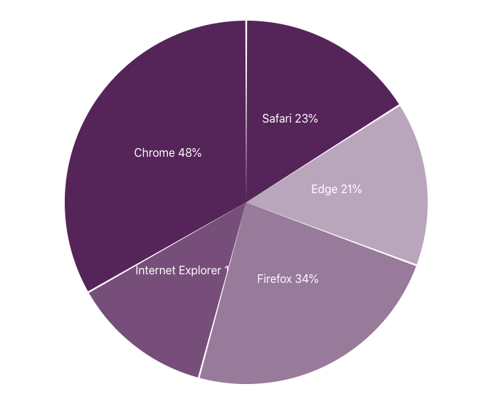
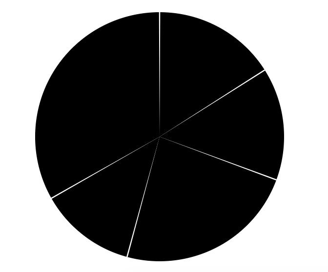
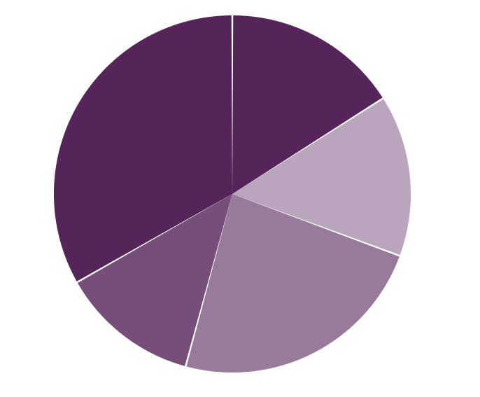

Airbnb visx is a library that offers visualisation components that we can use to create own chart components. In this article we will create a pie chart component using visx. The library uses several D3 packages internally for data processing. And for rendering it's just React. Essentially for a React application it is best of both worlds. D3 for calculations and React for rendering.

Here is how our final result will look. It is a pie chart that shows browser usage on a certain date. The browser usage data is a mock that is generated for the purpose of this article.



### Step 1 Install required packages.

An important benefit of visx is that it is split into multiple packages. We can pick and choose only the packages required for our application. It helps to keep the bundle size minimal.

```jsx
npm install --save @visx/group @visx/scale @visx/shape
```

### Step 2 Gather the data.

Our browser usage is defined in the following array of objects. Usage is in percent values.

```jsx
type BrowserUsage = {
  browser: string;
  usage: number;
}

const data: BrowserUsage[] = [
  { browser: 'Chrome', usage: 48},
  { browser: 'Internet Explorer', usage: 18},
  { browser: 'Firefox', usage: 34},
  { browser: 'Edge', usage: 21},
  { browser: 'Safari', usage: 23},
];
```

### Step 3: The pie chart component definition

We will pass this data as a prop to our component. We will also specify fixed width and height for this chart. In a separate article we can leverage another visx component called `visx/responsive` to make the chart responsive.

Pie chart will render from the center of the svg. This will require finding out the horizontal and vertical center of the svg box as follows. We will then use these `top` and `left` values to position the pie chart.

We will also define the radius of pie based on the width of height values.

```jsx
export type PieChartProps = {
  width: number;
  height: number;
  events?: boolean;
  data: BrowserUsage[];
  margin?: { top: number; right: number; bottom: number; left: number };
};

const defaultMargin = { top: 40, right: 30, bottom: 50, left: 40 };
const getUsage = (d: BrowserUsage) => d.usage;

export default function PieChart({ width, height, data, events = false, margin = defaultMargin }: PieChartProps) {
  
  const innerWidth = width - margin.left - margin.right;
  const innerHeight = height - margin.top - margin.bottom;
  
  const centerY = innerHeight / 2;
  const centerX = innerWidth / 2;
  const top = centerY + margin.top;
  const left = centerX + margin.left;

	const radius = Math.min(innerWidth, innerHeight) / 2;
	
	return null; // no rendering yet.
}
```

Lets use `Pie` component provided by `visx/shape` to create the pie chart. It takes `data`, `pieValue` - represents each portion of the pie and `outerRadius`. We can also optionally pass `padAngle` to add space between each portion.

```jsx
...
return(
	<svg width={width} height={height}>
	  <Group top={top} left={left}>
	    <Pie
	      data={data}
	      pieValue={getUsage}
	      outerRadius={radius}
	      padAngle={0.01}
	    />
		</Group>
	</svg>
);
```

At this stage one might expect that our pie chart is done and ready to show. And this is what we get:



We need to show each arc in a different color and also it is useful to show text on each arc to indicate what it represents.

As mentioned visx is a set of premitives and we need to do bit more work to make this happen. 

We will define a scale function that returns color based on the browser and its usage. We will use ordinal scale that will map our discreet browser names to different colors.

```jsx
import { scaleOrdinal } from "@visx/scale";

const getBrowserColor = scaleOrdinal({
    domain: data.map((l) => l.browser),
    range: [
      "rgba(93,30,91,1)",
      "rgba(93,30,91,0.8)",
      "rgba(93,30,91,0.6)",
      "rgba(93,30,91,0.4)"
    ]
  });

```

To modify each portion of the pie as an arc we can use a render function that receives the arc generator as follows:

```jsx
return (
    <svg width={width} height={height}>
      <Group top={top} left={left}>
        <Pie
          data={data}
          pieValue={getUsage}
          outerRadius={radius}
          padAngle={0.01}
        >
        {(pie) => {
							// map over each arc...
            return pie.arcs.map((arc, index) => {
              const { browser } = arc.data; // get the current browser
              const arcPath = pie.path(arc); // svg path for the arc
              const arcFill = getBrowserColor(browser); // We will use our custom function above to get the color of the shape.
              return (
                <g key={`arc-${browser}-${index}`}>
                  <path d={arcPath} fill={arcFill} />
			           </g>
              );
            });
          }}  
        </Pie>
      </Group>
    </svg>
  );
}
```

And here is what gets rendered



And finally we will use `visx/text` to show browser name and % value for each arc as follows:

```jsx
return (
    <svg width={width} height={height}>
      <Group top={top} left={left}>
        <Pie
          data={data}
          pieValue={getUsage}
          outerRadius={radius}
          padAngle={0.01}
        >
        {(pie) => {
            return pie.arcs.map((arc, index) => {
              const { browser } = arc.data;
              const [centroidX, centroidY] = pie.path.centroid(arc);
              const hasSpaceForLabel = arc.endAngle - arc.startAngle >= 0.1;
              const arcPath = pie.path(arc);
              const arcFill = getBrowserColor(browser);
              return (
                <g key={`arc-${browser}-${index}`}>
                  <path d={arcPath} fill={arcFill} />
                  {hasSpaceForLabel && (
                    <text
                      x={centroidX}
                      y={centroidY}
                      width={50}
                      dy=".11em"
                      fill="#ffffff"
                      fontSize={16}
                      textAnchor="middle"
                      pointerEvents="none"
                    >
                      {arc.data.browser} {arc.data.usage}%
                    </text>
                  )}
                </g>
              );
            });
          }}  
        </Pie>
      </Group>
      
    </svg>
  );
}
```

