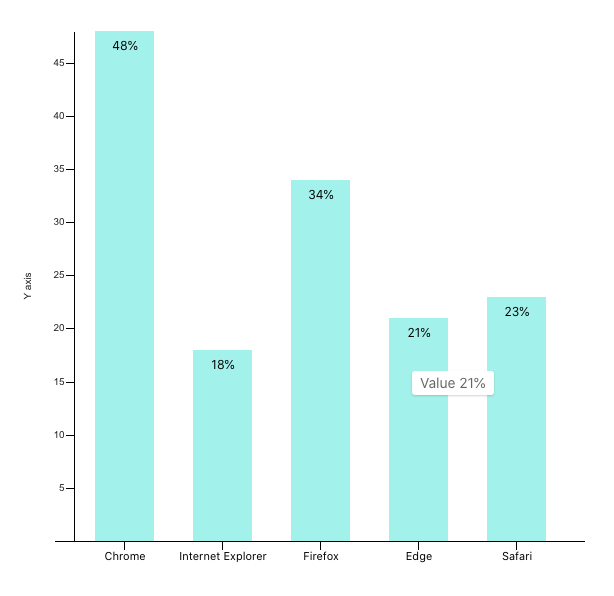

In previous article we created a bar chart using visx primitive components. In this article let's add a tooltip to the bars when user hovers on them. This is useful ux pattern on charts to show additional information about each bar (or any other individual piece of a chart). The tooltip shows on hover and as user moves the mouse away from a bar it vanishes.

You can refer to existing component code here [Codesandbox link]

### Step 1 Lets begin by installing `visx/tooltip` package.

```jsx
npm install --save @visx/tooltip @visx/event
```

Packages provides 

1. `useTooltip` hook. This hook return an object that we can use to render and control the tooltip.
2. `useTooltipInPortal` hook that gives us components called `Tooltip` and `TooltipInPortal`. Data from above `useTooltip` is passed as props to these components that render the tooltip.

### Step 2 implementing tooltip hooks in our bar chart.

I will explain the code blocks and purpose of each block followed by entire component source code at the end.

First we will call both the hooks in our bar chart component.

```jsx
const {
    tooltipData,
    tooltipLeft,
    tooltipTop,
    tooltipOpen,
    showTooltip, // on hover we will call this function to show tooltip
    hideTooltip, // and this one to hide it
  } = useTooltip();

  const { containerRef, TooltipInPortal } = useTooltipInPortal({
    detectBounds: true,
    // when tooltip containers are scrolled, this will correctly update the Tooltip position
    scroll: true,
  });

```

Next we will define the mouse over handler that will be called for each bar item.

From event parameter we will use `localPoint` to get coordinates of the mouse position where tooltip will be displayed. And these will be set on the tooltip as follows.

```jsx
let tooltipTimeout: number;
// mouseMove is better in terms of ux compared to mouseOver
onMouseMove={event => {
  if (tooltipTimeout) clearTimeout(tooltipTimeout);
  // TooltipInPortal expects coordinates to be relative to containerRef
  // localPoint returns coordinates relative to the nearest SVG, which
  // is what containerRef is set to in this example.
  const eventSvgCoords = localPoint(event);
  const left = barX || 0 + barWidth / 2;
  showTooltip({
    tooltipData: `${Math.round(getUsage(d))}%`,
    tooltipTop: eventSvgCoords?.y,
    tooltipLeft: left,
  });
}}
onMouseLeave={() => {
  tooltipTimeout = window.setTimeout(() => {
    hideTooltip();
  }, 300);
}}
```

### Step 3 rendering the tooltip component

And finally during the render we need to set the `ref` to the svg tag and render the tooltip as follows.

```jsx
<>
	<svg width={width} height={height} ref={containerRef}>
	//... existing chart component code
	</svg>
	{tooltipOpen && (
	  <TooltipInPortal
	    // set this to random so it correctly updates with parent bounds
	    key={Math.random()}
	    top={tooltipTop}
	    left={tooltipLeft}
	  >
	    Usage {tooltipData} 
	  </TooltipInPortal>
	)}
</>
```

And now each of the bars show a tooltip as shown in screenshot below.



Tooltip component also accepts style prop we can use to update the look and feel.

```jsx
const tooltipStyles = {
  minWidth: 60,
  backgroundColor: 'rgba(0,0,0,0.9)',
  color: 'white',
};
```

### Additional notes on the tooltip components from documentation.

If you don't want to render tooltip using portal then replace `TooltipInPortal` with `Tooltip` and drop the `containerRef` as its not required.

However rendering tooltip in portal is recommended to avoid z-index issues.

For correct tooltip positioning, it is important to wrap your component in an element (e.g., div) with relative positioning though in our case it worked without it.

Here is Codesandbox link to our completed bar chart component.

References

Official docs for visx/tooltip [https://airbnb.io/visx/docs/tooltip](https://airbnb.io/visx/docs/tooltip)