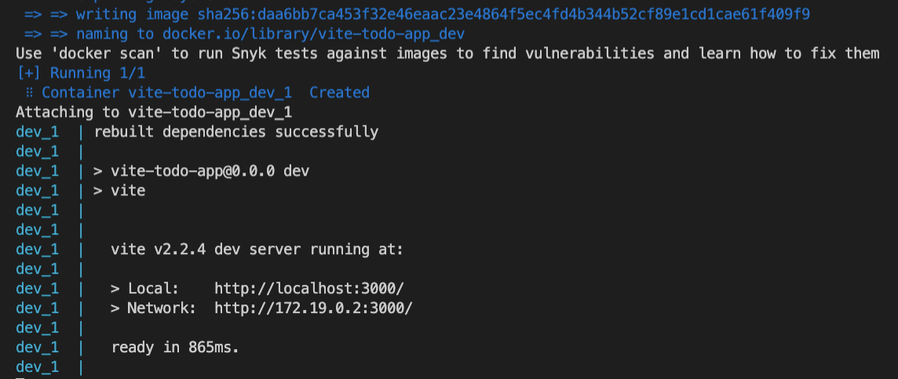

In a previous article I demonstrated how to use modern blazing fast build tool Vite to create setup a React application. Often times we have a requirement to run the frontend application in docker. Especially for backend teams where they probably don't have to setup frontend application on their local environments. This articles assumes you already have docker desktop installed on your development machine.

We will achieve this by creating a `Dockerfile` and a `docker-compose.yml` files at the root of our application source code.

Dockerfile is a text file that contains the commands to create our docker image. And another utility called Compose by making use of `docker-compose.yml` file will run this container as a service for us.

### Step 1: Create a Dockerfile

```jsx
FROM node:15.12.0

WORKDIR /app

COPY entrypoint.sh /entrypoint.sh
RUN chmod +x /entrypoint.sh

ADD . .

RUN npm install

ENTRYPOINT ["/entrypoint.sh"]

CMD ["npm", "run", "dev"]
```

We start by defining the base image to host our application in. 

/app is a directory where we host our source code.

`ADD . .` copies the source code from source code on host machine over to container's `/app` directory.

We run `npm install` inside the image.

And finally `npm run dev` to start the application.

## Step 2 Resolving an issue with `esbuild` in docker container

Vite uses esbuild internally. We need to rebuild `esbuild` for container architecture during the startup to make it function without errors.

Create a file called `[entrypoint.sh](http://entrypoint.sh)` at root of app source.

```jsx
#!/bin/sh

npm rebuild esbuild

exec "$@"
```

As specified in the Dockerfile above [entrypoint.sh](http://entrypoint.sh) will be copied over to the docker image and will be run after npm install is completed.

Step 3 docker-compose.yml

```jsx
version: '3.8'

services:
  dev:
    build: 
      context: ./
      dockerfile: Dockerfile
    volumes:
      - ./:/app
    ports:
      - '3000:3000'
```

And finally run `docker compose up` in the terminal at the root of your application and you should see following output.



Your application will be running at http://localhost:3000. 

Reference : [https://github.com/vitejs/vite/issues/2671#issuecomment-829535806](https://github.com/vitejs/vite/issues/2671#issuecomment-829535806) 
