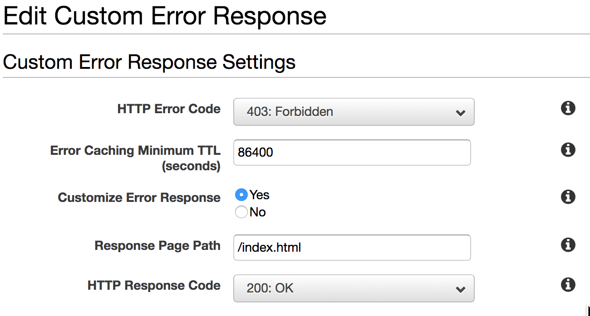

In a previous article we created a starter app using Vite 2.0 and React. AWS offers convinient way to host our application as a static website using S3 file storage and Cloudfront. This article will demonstrate the steps to host using aws console manually. In next article (link) we will create a Github action to handle automatic deployment. We will also ensure that client side routing works as expected with the Cloudfront distribution.

## Step 1 Create S3 bucket for file storage.

Run `npm run build` at the root of the application. This will generate `dist` directory containing the entire application code. This will essentially be a index.html at the root and js, css and assets inside a folder next to it.

Login into aws console. Select S3 from top navigation. Create a new S3 bucket with appropriate name. For instance you can use your applications public domain/subdomain combination as a bucket name.

In the Buckets list, choose the name of the bucket that you want to enable static website hosting for.

Choose Properties.

Under Static website hosting, choose Edit.

Choose Use this bucket to host a website.

Under Static website hosting, choose Enable.

In Index document, enter the file name of the index document, typically index.html.

For the error document also provide index.html as name since we want all routes to be handled by the application.

Click save changes.

Under Static website hosting, note the Endpoint.

## Step 2 Upload application `dist` content to S3 bucket

In S3 bucket list select the bucket we just created. In Objects tab click on Upload button. Select the contents of `dist` folder and upload all files.

## Step 3 Configure Cloudfront distribution

We will use Cloudfront CDN to serve the hosted website. Serving S3 files as publicly isn't recommended for most if not all practical purposes. [read more about benefits here(add link)].

Here is a guided walkthrough to complete this step. Once completed we will continue with setup required for React router client side routes.

<a href="https://docs.aws.amazon.com/AmazonS3/latest/userguide/website-hosting-cloudfront-walkthrough.html" target="_blank">docs.aws.amazon.com/AmazonS3/latest/userguide/website-hosting-cloudfront-walkthrough.html</a>

At this stage when you navigate to your application url in browser it should show you the deployed application. When you navigate between different routes they should work as expected. But when you are at a certain route and browser page is reloaded it will show blank or error page. This is because cloudfront isn't aware of client side route pages. Lets resolve this issue next.

## Step 4 Setup error pages in Cloudfront

We will configure cloudfront error pages so that all failed requests are still routed to our application's `index.html`. As long as request arrive to the application entry page React router can load related route based on the url.

Select the cloudfront distribution you just created. 

Click on 'Error Pages' tab.

Add new custom error response as shown the image.

Follow the same for one more error code - 404 not found.

###