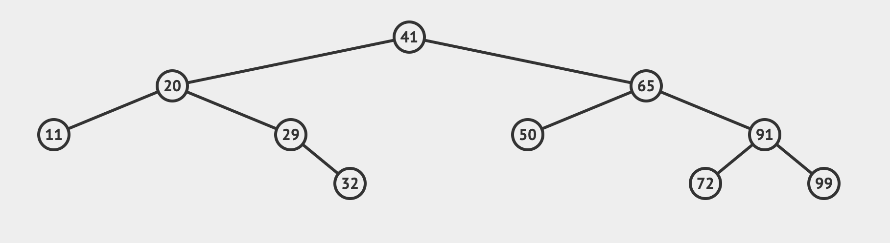
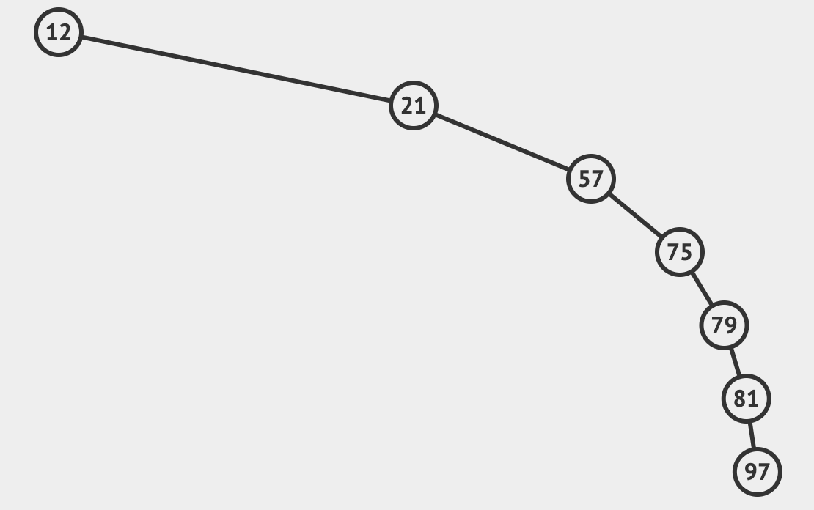
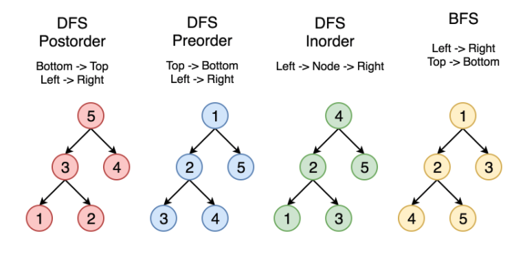

## What is Binary Search Tree?

> Rule is value of left children is less than root and value of right children is greater than root at any level.

For example - In above tree, lets take node with value 65 (you can take any node), left children is 50 which is less than 65 and right children 91 which is greater than 65.

#### Benefits - 

Common operation on data are - Insertion, Deletion, Search, Sort.
Binary Search Tree shines in use cases related to sorting and serching. Below are some examples - 

* Get all nodes in sorted order

    Sorting is expensive operation. Best time complexity you can achieve is O(n log n) using sorting algorithms (except like Radix sort but those only work with specific type of data). 

    We can get all nodes in sorted order by doing Inorder Traversal on Binary tree. Time complexity is O(n)

- Find all keys between range

    We have a binary tree and we want to find all keys in between min = 10 and max = 20

- Search operations where data is constantly changing

## Flavours of BST

Insertion, Deletion, Search, Sort; these operations takes O(h) where h is height of tree. So it is important to balance a BST. If tree is not balanced as in example below then time complexity for all these operations becomes O(n)

 

Hence, balancing BST is very important. Below are some of flavours of BST to achieve balancing of tree. (<a href="https://en.wikipedia.org/wiki/Self-balancing_binary_search_tree" target="_blank">/wiki/Self-balancing_binary_search_tree</a>)

1. AVL Tree

    Difference between subtrees cannot be more than one for all nodes. AVL is always a balanced tree, but insertion and deletion is expensive as it requires multiple rotations/re-arrangement.

2. Splay Tree

    Pareto Principle - "80% of outcomes (outputs) come from 20% of causes" applies for data as well. In scenario where we have millions of keys, it would be better if we can move them to top of tree. Splay tree will move searched key to root and balance the tree. 

## Implementation 

Remember the rule - *Value of left children is less than root and value of right children is greater than root at any level*

(Images and videos are created using - <a href="https://visualgo.net/" target="_blank">visualgo.net</a>

I am going to explain algorithm pictorially. I hope code and comments are self explanatory.

1. ***insert***

    <iframe frameborder="0" src="/video/?file=bst.mp4" width="400" height="220"></iframe>

2. **isValid**

    This method checks if current tree is valid Binary Search Tree. 

    Pseudocode - 

    * We call function recursiveCheck(tree) on the root of tree

    * Inside recursiveCheck(), if tree received is empty we stop. This will happen when we reach at the end of tree

    * If root is not blank, we check if tree follow BST rule (check above). If not we return false which means tree is not valid.

    * We go deep one level and check left and right children by calling recursiveCheck(tree.left) && recursiveCheck(tree.right)

3. **Tree Traversal** Time Complexity O(n)

    We are going to implement Breadth First Traversal and Depth First Traversal - Preorder, Inorder and Postorder. Below diagrams explain the sequence in which we will get the data.

    What are the use cases? 

    * When we want data in sorted order we can use inorder traversal (remember sorting algorithms can only go upto O(n log n). Here we are going to achieve same in O(n))

    * Lets say we have Splay tree (most used nodes are at top) then we can use BFS to find the element 

    

## Full Code <a href="https://github.com/swapnil00patil/js-algo/blob/master/binary-search-tree/bst.js" target="_blank">Github</a> or Try Below
<iframe frameborder="0" width="100%" height="800px" src="https://replit.com/@swapnil00patil/BinarySearchTree?lite=true"></iframe>