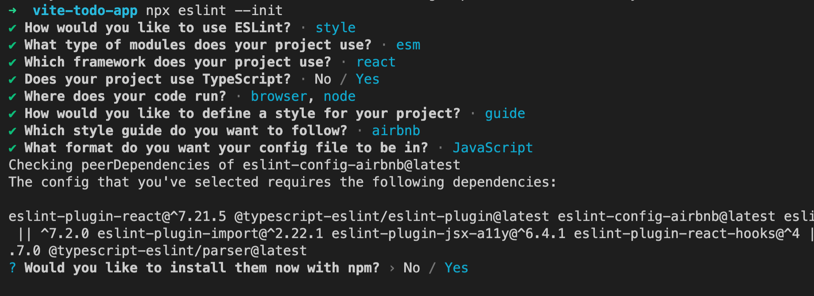

## Getting started with Vite 2 and React

Title options

Creating your own Vite 2, React, Typescript starter template.

Beginner guide to using Vite 2 in your React + typescript application.

Vite is a next generation build tool that is blazingly fast for development and aides in bundling for production for legacy browsers. Its opinionated and brings a pleasant developer experience with sensible defaults and optionally via additional configuration and plugins. In this article we will create our own starter template for React application. Our production ready React application will require:

- Typescript support
- React router
- Redux (or any other state management solution)
- Eslint and prettier
- Styled components
- Jest

## Step 1 Start with React template offered by Vite.

```jsx
npm init @vitejs/app vite-todo-app --template react-ts
```

Once its done run the following to complete the installation and verify its running.

```jsx
cd vite-todo-app
npm install
npm run dev
```

When u bring up [http://localhost:3000](http://localhost:3000) it shows a page similar to the one offered by Create React App. You can play by modifying the text or styles and you will be amazed by how fast the changes are reflected in the browser.

### Folder structure

src - contains the application source code 

src/main.tsx - This is the entry script from where the execution starts.

package.json - it comes with react, react-dom and typescript.

tsconfig.json - here we can modify the typescript config as needed.

vite.config.ts - Vite itself can be configured by modifying this file.

## Step 2 Install and setup Eslint

```jsx
npm install --save-dev eslint
```

To setup eslint we begin by running the following in the terminal.

```jsx
npm eslint --init
```

This will launch an interactive tool that will ask you few questions. Following screenshot depicts the answers for each question in blue. Based on this information additional packages will be installed. It will also add a .eslintrc file in the root of our application directory.



<iframe frameborder="0" src="http://localhost:8000/video/bst.mp4" width="400" height="320"></iframe>

### ESLint rules configuration

We will need to augment the rules object in .eslintrc.js file with following rules to make it work for our application. When the application is open in VSCode or Webstorm you should start seeing reported errors in 'Problems' tab.

```jsx
rules: {
    'react/jsx-filename-extension': ['error', { extensions: ['.tsx', '.jsx'] }],
    'react/prop-types': 'off',
    'react/jsx-one-expression-per-line': 'off',
    'no-use-before-define': 'off',
    '@typescript-eslint/no-use-before-define': ['error'],
  },
```

If you open App.tsx file at this stage, it will still show linting errors for import statements such as `'import App from './App'`. To resolve this we need to improve eslint typescript tooling.

Lets install Airbnb typescript config. This config is a drop-in replacement for eslint-config-airbnb, decorating it with TypeScript support. While at it let's also install jest support for eslint that we will use in a later section.

```jsx
npm install eslint-config-airbnb-typescript eslint-plugin-jest --save-dev
```

We also need to let eslint know that we want to ignore parts of application during linting. Create a `.eslintignore` file at the root and add the following.

```jsx
node_modules
.DS_Store
dist
dist-ssr
*.local
node_modules/*
```

## Step 3 Installing Prettier

Prettier when installed will work with eslint and will automatically resolve issues and format the code for us.

```jsx
npm install eslint-config-prettier eslint-plugin-prettier prettier --save-dev
```

Add the "plugin:prettier/recommended" at the end of "extends" array in `.eslintrc.js` file. This is how it should look:

```jsx
extends: [
    'airbnb-typescript',
    'plugin:react/recommended',
    'prettier',
    'plugin:jest/recommended',
  ],
```

Similar to eslint we can also let prettier know about the parts we want to ignore via `.prettierignore` file.

```jsx
node_modules
.DS_Store
dist
dist-ssr
*.local
node_modules/*
```

Additionally we may also want to define our own custom prettier configuration for formatting rules. Create a `.prettierrc` file at the root containing:

```jsx
{
  "singleQuote": true,
  "tabWidth": 2,
  "bracketSpacing": true,
  "trailingComma": "none",
  "printWidth": 100,
  "semi": false,
  "overrides": [
    {
      "files": ".prettierrc",
      "options": { "parser": "typescript" }
    }
  ]
}
```

## Step 4 Unit tests with jest

This is currently no vite plugin for jest. There is an open issues that can be tracked here [https://github.com/vitejs/vite/issues/1955](https://github.com/vitejs/vite/issues/1955) 

We can still use jest and this is how we do it.

```jsx
npm install --save-dev jest ts-jest @testing-library/react @testing-library/jest-dom @types/jest
```

Create `jest.config.js` at the root and paste the following.

```jsx
module.exports = {
  preset: 'ts-jest',
  moduleDirectories: ['node_modules', 'src'],
  testEnvironment: 'jsdom',
  testMatch: [
    '<rootDir>/src/**/__tests__/**/*.{js,jsx,ts,tsx}',
    '<rootDir>/src/**/*.{spec,test}.{js,jsx,ts,tsx}',
  ],
};
```

We will add a command  `"test": "jest src"` to run our test in package.json as follows

```jsx
"scripts": {
    "dev": "vite",
    "build": "tsc && vite build",
    "serve": "vite preview",
    "test": "jest src"
  },
```

At this point let's add a simple unit test to the application. Create a file called `App.test.tsx` at the root and paste the following.

```jsx
import React from 'react';
import { render, screen } from '@testing-library/react';
import App from './App';

test('renders the app', () => {
  render(<App />);
  screen.debug();
});
```

At this point when we run `npm test` command in terminal it throw error saying `SyntaxError: Unexpected token '<'` 

This requires letting jest know about parsing `svg` and/or `css` files. Lets fix it in `jest.config.js`

```jsx
module.exports = {
  ...// existing content
  moduleNameMapper: {
    '\\.(css|scss)$': 'identity-obj-proxy',
  },
  "transform": {
    "^.+\\.svg$": "<rootDir>/svgTransform.js" 
 },
};
```

```jsx
npm install --save-dev identity-obj-proxy
```

And finally open `tsconfig.json` and ensure `"esModuleInterop": true,`.

Run `npm test` again and the test should pass.

And thats it. This should get the ball rolling and serve a great starting point for a React application.